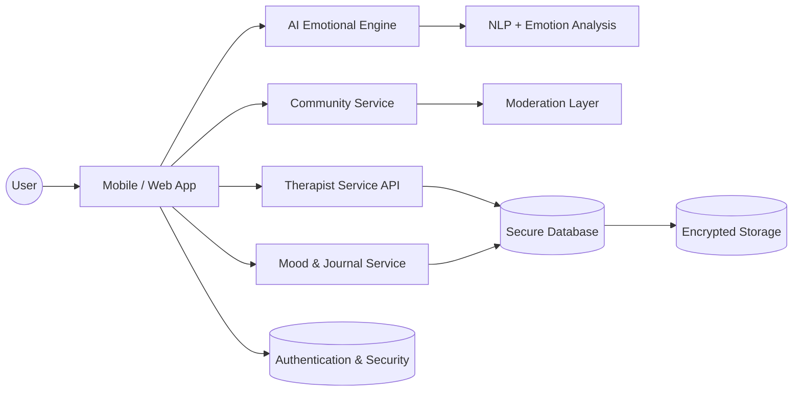
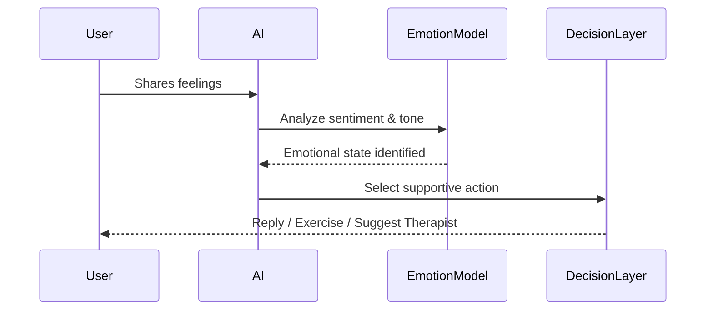
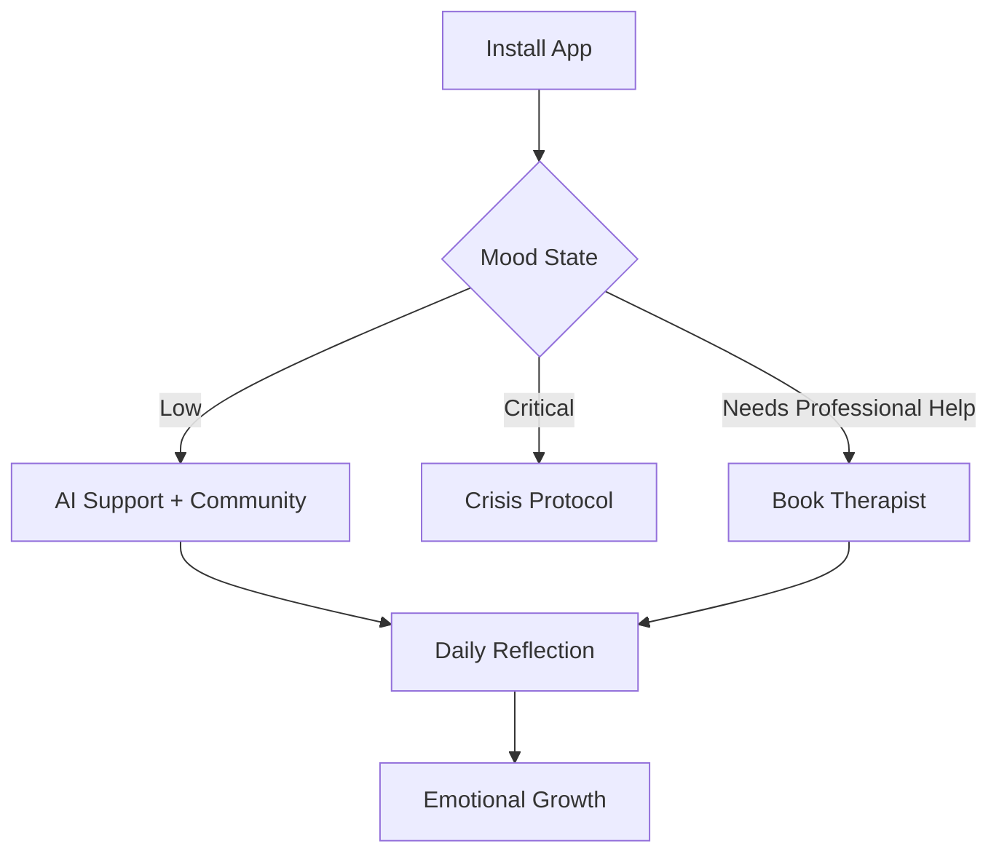
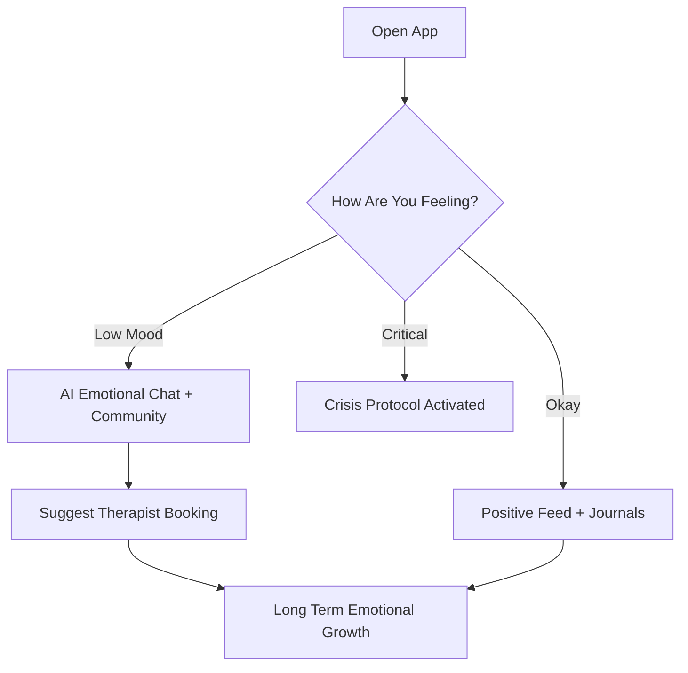

# 🌿 NIVARA — Your Safe Space for Healing, Guidance & Growth

### 🧠 Connecting People with Licensed Therapists + AI Emotional Support + Safe Community

Nivara is a next-generation mental wellness ecosystem that blends:

* Clinical emotional support
* AI-powered empathetic assistance
* A warm, safe community space

All in one compassionate platform.

---

## 🌟 Why Nivara?

Today, most platforms either:

* ❌ Only provide therapy
* ❌ Only give journaling + meditation
* ❌ Only support anonymous chats

But **real emotional healing requires balance**:

* ✔ Professional guidance
* ✔ Always-available support
* ✔ A positive community
* ✔ Science-backed emotional growth tools
* ✔ Affordable access

**Nivara bridges that gap.**

---

## ✨ Core Features

### 1️⃣ Therapist & Psychologist Connections

* Book verified mental health professionals
* Secure video, audio and chat sessions
* Affordable subscription models
* Filter by specialization:

  * Depression
  * Anxiety
  * Burnout
  * Trauma
  * Student issues
  * Relationship counseling

---

### 2️⃣ AI Emotional Support Companion

A purpose-built AI designed only for **mental wellness support**, not just chatting.

* Understands emotion & tone
* Provides empathetic responses
* CBT-based thought reframing
* Gentle grounding techniques
* Always available, judgment-free

> AI does **not** replace therapists. It supports users until they connect to one.

---

### 3️⃣ Safe Community Space

A healing environment — not just another social feed.

* Anonymous posting
* Topic-based support spaces
* Peer interaction
* Strict moderation + AI toxicity filter

---

### 4️⃣ Wellness Feed

A daily space filled with positivity.

* Affirmations
* Educational mental wellness posts
* Coping strategies
* Real recovery stories

---

### 5️⃣ Mood & Reflection Suite

* Daily mood tracker
* Emotion journaling
* Voice journaling + transcription
* “How was your day?” reflections
* Emotional growth analytics

---

### 6️⃣ Safety & Crisis Mode

If critical distress is detected:

* Grounding protocol starts
* Therapist assistance suggested
* Verified emergency helplines displayed
* Optional trusted-guardian alert

---

#  Architecture Overview



---

#  AI Emotion Engine



---

#  User Journey



---

#  Security & Trust

* HIPAA-ready architecture
* End-to-end encrypted sessions
* Anonymous posting
* Strict moderation
* No data selling

---
## 🧰 Tech Stack 

### **Frontend — Flutter**

* Flutter (Dart)
* Riverpod / Bloc (State Management)
* Material 3 + Custom Wellness UI
* Lottie animations for calming visuals
* Web support optional

---

### **Backend**

* Node.js (Fastify / Express) **or** Django (your choice)
* PostgreSQL + MongoDB hybrid
* Supabase / Firebase Auth
* WebSockets for realtime chat
* REST + GraphQL Support

---

### **AI Layer**

* OpenAI / Gemini / LLaMA
* Custom Emotion Detection Model
* Context memory engine
* Safety filtered response layer

---

### **Infrastructure**

* Firebase + Supabase combo
* AWS / GCP
* Secure Encryption Layer
* Cloud Functions for sensitive logic

---


## 🧬 Flutter App Modular Structure 

```text
/lib
 ├── core
 │   ├── theme
 │   ├── utils
 │   └── services
 ├── features
 │   ├── auth
 │   ├── therapist_booking
 │   ├── ai_chat
 │   ├── community
 │   ├── mood_tracker
 │   ├── crisis_system
 │   └── profile
 ├── state
 │   ├── providers
 │   └── blocs
 ├── widgets
 └── main.dart
```

---

## 🎥 Therapy & AI System 




---

# 🚀 Roadmap

* Personalized therapy plans
* Meditation studio
* Wearable integrations
* Emotional AI memory
* Workplace & campus wellness
* Multilingual support

---

# 💚 Philosophy

Mental health is not weakness.
It is human.
Everyone deserves a safe place to heal.

**Nivara = Relief | Support | Peace**

---

# 🤝 Join Us

We welcome:

* Developers
* Therapists
* Researchers
* Volunteers

Let’s build Nivara together.


